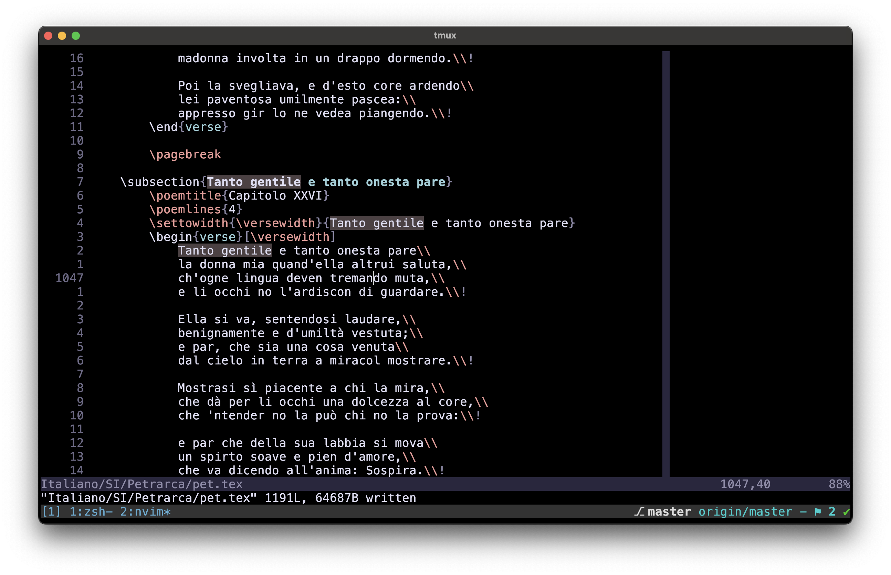
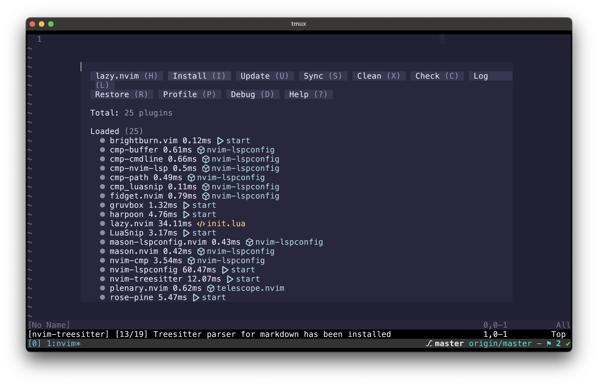
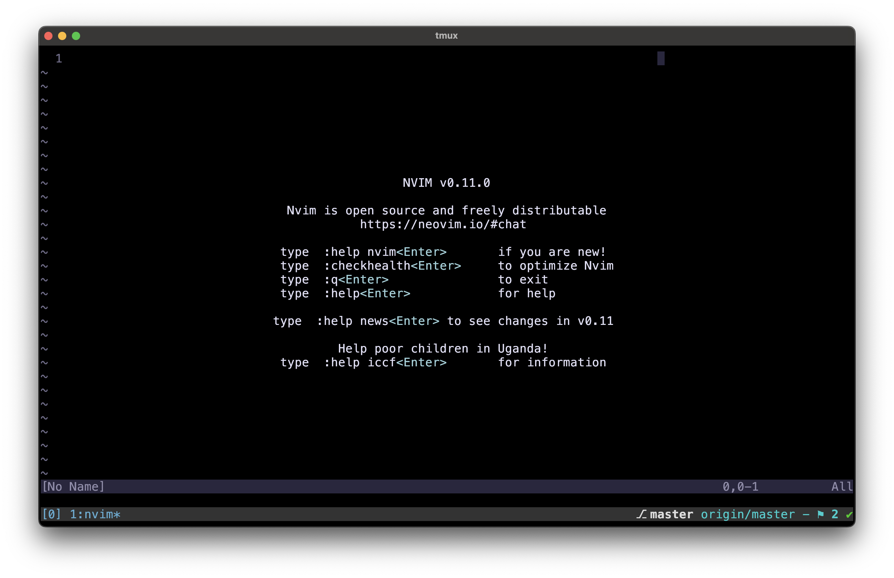
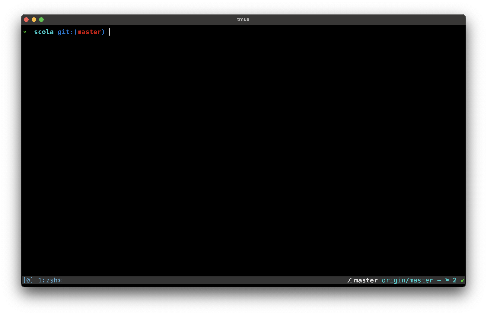
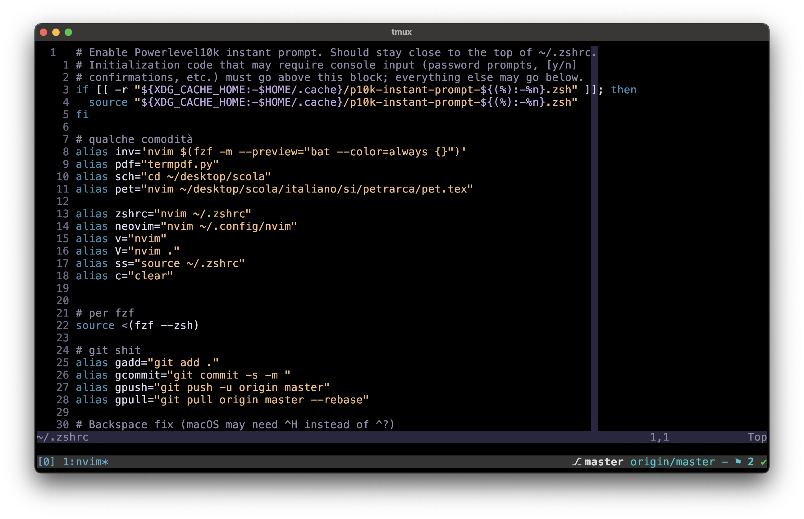

# Hello there

My neovim configuration is not as interesting as you might think. It has all the necessary plugins that I need for my everyday use.

I mostly use neovim for note-taking in LaTeX. The necessary plugins are hence [lervag/vimtex](https://github.com/lervag/vimtex), [L3MON4D3/luasnip](https://github.com/L3MON4D3/LuaSnip) and [nvim-treesitter/nvim-treesitter](https://github.com/nvim-treesitter/nvim-treesitter). More general plugins that I use are [ThePrimeagen/harpoon](https://github.com/ThePrimeagen/harpoon) and [tmux/tmux](https://github.com/tmux/tmux/wiki) (which is not a vim plugin but I include it because it's a substantial part of my workflow).

Here below there are some (boring) screenshots of my terminal:

# Screenshots

